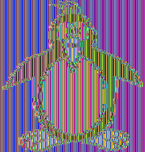
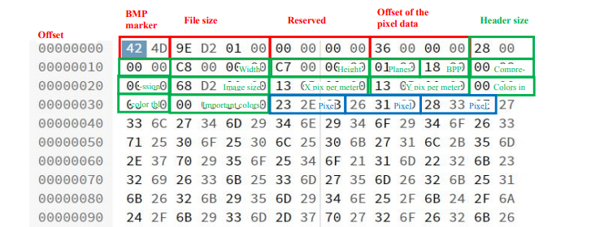

# Image Encryption using AES (ECB and CBC)

This project demonstrates the encryption and decryption of images using **AES** in two modes: **Electronic Codebook (ECB)** and **Cipher Block Chaining (CBC)**.

## Introduction

This project is designed to demonstrate how to use **AES encryption** in **ECB** and **CBC** modes to encrypt and decrypt image files. The following operations are implemented:

- **AES/ECB Encryption** and **Decryption**
- **AES/CBC Encryption** and **Decryption**

In this project, the image `penguin.bmp` is used as an example to demonstrate the encryption and decryption process.

## Files in the "images" Folder:

- **bmp-header.png**: A visual representation of the image header.
- **penguin.bmp**: Original image that will be encrypted and decrypted.
- **encrypted_ecb.bmp**: Image encrypted using **AES/ECB** mode.
- **decrypted_ecb.bmp**: Image decrypted from **AES/ECB** encryption.
- **encrypted_cbc.bmp**: Image encrypted using **AES/CBC** mode.
- **decrypted_cbc.bmp**: Image decrypted from **AES/CBC** encryption.

## Encryption Modes

### 1. ECB (Electronic Codebook)

#### What is ECB?

**Electronic Codebook (ECB)** is one of the simplest modes of encryption where the plaintext is divided into fixed-size blocks, and each block is encrypted independently using the same encryption key. This mode is widely used for its simplicity but is not recommended for encrypting large or sensitive data due to its inherent weaknesses.

#### Characteristics of ECB:
- **Simplicity**: Each block of plaintext is encrypted independently.
- **Weaknesses**: Identical plaintext blocks will result in identical ciphertext blocks, making it vulnerable to pattern analysis.
- **Not Secure for Large Data**: ECB is not ideal for encrypting large datasets as it does not use any feedback mechanism to provide additional security.

#### Example of ECB Encryption Process:

1. The plaintext is split into fixed-size blocks.
2. Each block is encrypted independently using the same key.
3. The resulting ciphertext consists of encrypted blocks concatenated together.

#### ECB Encryption and Decryption:

- **Encrypted Image (ECB)**: 
- **Decrypted Image (ECB)**: 

### 2. CBC (Cipher Block Chaining)

#### What is CBC?

**Cipher Block Chaining (CBC)** is a more secure mode of encryption compared to ECB. In CBC, each plaintext block is XORed with the previous ciphertext block before being encrypted, adding a level of randomness and preventing identical plaintext blocks from producing identical ciphertext blocks.

#### Characteristics of CBC:
- **Chaining**: Each block of plaintext is XORed with the previous ciphertext block before encryption, providing additional security.
- **IV (Initialization Vector)**: CBC requires an initialization vector (IV) to start the encryption process, which adds further randomness.
- **Improved Security**: CBC eliminates the weakness of ECB where identical blocks lead to identical ciphertext blocks.

#### Example of CBC Encryption Process:

1. The first plaintext block is XORed with the IV (initialization vector).
2. The resulting XORed block is encrypted using the AES key.
3. Each subsequent block of plaintext is XORed with the previous ciphertext block before encryption.
4. The resulting ciphertext consists of encrypted blocks, each dependent on the previous block.

#### CBC Encryption and Decryption:

- **Encrypted Image (CBC)**: 
- **Decrypted Image (CBC)**: 

## BMP Header Image

Below is a visual representation of the **BMP header** of the image used in the encryption and decryption process:

- **BMP Header**: 

## Instructions to Run the Program

### Prerequisites

- **Java** and **JavaFX** must be installed on your system.

### Steps to Execute the Program:

1. Clone this repository to your local machine.
2. Open the project in your Java IDE (e.g., IntelliJ IDEA).
3. Modify the image paths in the code to match the locations on your system.
4. Run the program.
5. The program will encrypt the `penguin.bmp` image in both ECB and CBC modes, and save the results in the specified paths.

### File Locations:
- `penguin.bmp`: The original image to be encrypted.
- `encrypted_ecb.bmp`: The image encrypted using the ECB mode.
- `encrypted_cbc.bmp`: The image encrypted using the CBC mode.
- `decrypted_ecb.bmp`: The image decrypted from the ECB encrypted image.
- `decrypted_cbc.bmp`: The image decrypted from the CBC encrypted image.

### Example Execution:

After running the program, the following files will be generated:

- **encrypted_ecb.bmp**: Encrypted image using ECB mode.
- **decrypted_ecb.bmp**: Decrypted image from the ECB encrypted file.
- **encrypted_cbc.bmp**: Encrypted image using CBC mode.
- **decrypted_cbc.bmp**: Decrypted image from the CBC encrypted file.

The encrypted and decrypted images will be saved on your system with the respective names.

## Conclusion

This project demonstrates how **AES encryption** in **ECB** and **CBC** modes can be applied to image encryption. While **ECB** is simpler, it lacks the security features of **CBC**, which provides more robust encryption by using an initialization vector and chaining the blocks together.

---

